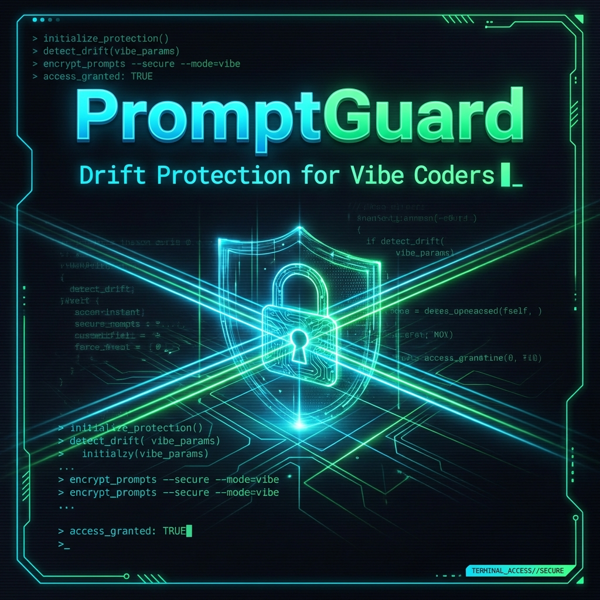

<p align="center">
  
</p>

<h1 align="center">PromptGuard</h1>

<p align="center">
  <strong>Treat prompts like code. Snapshot. Validate. Block drift.</strong>
</p>

<p align="center">
  <a href="https://github.com/mediamarktatti-maker/promptguard/actions"></a>
  <a href="https://www.bridgemind.ai/vibeathon"></a>
  <a href="LICENSE"></a>
  <a href="https://bun.sh/"></a>
  
</p>

<p align="center">
  <em>"Don't guess. Guard."</em>
</p>

---

## 🧠 Core Philosophy

> **Prompts are code. Treat them that way.**

| Without PromptGuard | With PromptGuard |
|---------------------|------------------|
| Prompt changes are invisible | Prompt changes are explicit |
| No review, no guardrails | Section-aware diffs for review |
| Failures appear late in production | Fail loud in CI, before deploy |
| "It worked yesterday" debugging | Deterministic baselines to compare |
| No version control for prompts | Git-committed snapshots |

---

## 🎯 Who Is This For?

- **Solo Builders** — Stop debugging drift. Sleep better.
- **Teams** — Enforce prompt review. Block accidental changes.
- **Agent Builders** — Protect multi-step workflows from cascading failures.
- **Prompt Maintainers** — Version control your prompts like source code.

If prompts matter in your system, **PromptGuard belongs in your repo**.

---

## ❌ The Problem

Prompts are the most fragile part of any AI system.

**Yet they have:**
- ❌ No version control
- ❌ No tests
- ❌ No CI gating
- ❌ No structured review

**The result?** Silent failures.

Your prompt drifts. Your agent breaks. You spend hours debugging, only to discover someone changed a single word three weeks ago.

**Existing solutions?**
- Require API keys and cloud services
- Don't fit into your Git workflow
- Are expensive or vendor-locked

---

## ✅ The Solution

PromptGuard is a **deterministic CLI** that treats prompts like source code:

```
┌─────────────────────────────────────────────────────────────┐
│                     PROMPTGUARD PIPELINE                    │
├─────────────────────────────────────────────────────────────┤
│                                                             │
│   Prompt (.md)                                              │
│        ↓                                                    │
│   [normalize]  →  Deterministic whitespace handling         │
│        ↓                                                    │
│   [parse]      →  Extract sections by heading               │
│        ↓                                                    │
│   [hash]       →  FNV-1a for speed (not crypto)             │
│        ↓                                                    │
│   [compare]    →  Snapshot vs current                       │
│        ↓                                                    │
│   PASS (exit 0)  or  FAIL (exit 1)                          │
│                                                             │
└─────────────────────────────────────────────────────────────┘
```

**Key properties:**
- **Deterministic** — Same input always produces same output
- **Local** — Nothing leaves your machine. No API keys required
- **Fast** — No network calls, no LLMs, just hashing
- **Git-native** — Snapshots commit alongside your code

---

## ⚡ Core Features

| Feature | Description | Why It Matters |
|---------|-------------|----------------|
| **Snapshot** | Create a baseline of your prompt | Track changes over time |
| **Diff** | Section-aware semantic diffing | See *what* changed, not just *that* it changed |
| **Check** | Validate required headings | Enforce structure before deploy |
| **Lock** | Freeze JSON output schema | Prevent breaking API changes |
| **Doctor** | Diagnose setup issues | Actionable fix commands |
| **JSON Output** | Machine-readable for CI | Integrate with any tooling |

---

## 🚀 Quickstart

```bash
# 1. Install
bun install

# 2. Initialize
bun tools/promptguard.ts init

# 3. Snapshot your prompt
bun tools/promptguard.ts snapshot prompts/my-agent.md -m "Initial baseline"

# 4. Check all prompts
bun tools/promptguard.ts check

# 5. See what changed
bun tools/promptguard.ts diff prompts/my-agent.md
```

**That's it.** Your prompts are now guarded.

---

## 📖 Real-World Workflow

### Before PromptGuard
```
1. Edit prompt
2. Deploy
3. Agent breaks in production
4. Debug for 3 hours
5. Find "must" was changed to "should"
6. Rage
```

### After PromptGuard
```
1. Edit prompt
2. Push to GitHub
3. CI runs: bun tools/promptguard.ts check
4. CI fails: "Section 'Constraints' changed"
5. Review diff, approve intentionally OR fix
6. Ship with confidence
```

---

## 🔧 The 7 Commands

### `status`
Quick overview of your PromptGuard setup.
```bash
bun tools/promptguard.ts status
```
Shows config status, tracked prompts, and suggested next actions.

---

### `init`
Initialize PromptGuard for your repository.
```bash
bun tools/promptguard.ts init
```
Creates `.promptguard/` directory, `promptguard.config.json`, and auto-discovers prompts in `prompts/`.

---

### `snapshot`
Create a baseline snapshot of a prompt.
```bash
bun tools/promptguard.ts snapshot prompts/example.md -m "Why this baseline exists"
```
Saves a timestamped snapshot with SHA hash for integrity.

---

### `diff`
See section-aware changes between current and snapshot.
```bash
bun tools/promptguard.ts diff prompts/example.md
bun tools/promptguard.ts diff prompts/example.md --json  # Machine-readable
```
```diff
## Output
- old: respond in JSON
+ new: respond in YAML
```

---

### `check`
Validate all prompts against required headings and locked schemas.
```bash
bun tools/promptguard.ts check
bun tools/promptguard.ts check --json  # For CI dashboards
```
Exit code 0 = all good. Exit code 1 = drift detected.

---

### `lock`
Freeze the JSON output schema in your prompt.
```bash
bun tools/promptguard.ts lock prompts/extractor.md
```
If someone changes the JSON structure, `check` will fail.

---

### `doctor`
Diagnose setup issues with actionable fixes.
```bash
bun tools/promptguard.ts doctor
```
Checks config validity, missing files, orphaned snapshots.

---

## 🤖 CI / Automation

Add PromptGuard to your GitHub Actions:

```yaml
name: PromptGuard Check

on:
  push:
    branches: [main]
  pull_request:

jobs:
  promptguard:
    runs-on: ubuntu-latest
    steps:
      - uses: actions/checkout@v4
      - uses: oven-sh/setup-bun@v2
      - run: bun install
      - run: bun tools/promptguard.ts check --json
```

**When prompts drift, CI fails. No silent breakage.**

The `--json` flag outputs structured results for dashboards and tooling.

---

## 📊 What PromptGuard Checks

| Check | Description | Failure Mode |
|-------|-------------|--------------|
| **Required Headings** | Prompts must include configured sections | Missing `## Goal` → FAIL |
| **Section Drift** | Content changed vs baseline | Section hash mismatch → DIFF shown |
| **JSON Schema** | Locked output format must match | Schema drift → FAIL |
| **File Integrity** | Tracked files must exist | Missing file → FAIL |

---

## ⚙️ Configuration

`promptguard.config.json`:
```json
{
  "snapshots": "git",
  "requiredHeadings": ["Goal", "Constraints", "Output", "Examples", "Failure modes"],
  "schemaLocks": {
    "prompts/extractor.md": { "type": "json_fence" }
  }
}
```

---

## 🧩 What PromptGuard Is NOT

| What It's Not | Why |
|---------------|-----|
| An LLM wrapper | No AI calls. Pure hashing. |
| A cloud service | 100% local. Nothing leaves your machine. |
| Expensive | Free. Open source. MIT license. |
| Complex | Clone, install, run. That's it. |

---

## 🏆 Why This Project Wins

1. **Solves a Real Problem** — Prompt drift is painful and universal
2. **Zero External Dependencies** — No API keys, no cloud, no vendor lock-in
3. **Fits Existing Workflows** — Git, CI, command line
4. **Fail-Loud Philosophy** — Catch problems before production, not after
5. **Usable Today** — Not a prototype. Production-ready right now.

---

## 🗺️ Roadmap

| Phase | Feature | Status |
|-------|---------|--------|
| **v1.0** | Core CLI (init, snapshot, diff, lock, check, doctor) | ✅ Complete |
| **v1.1** | VS Code extension for inline drift warnings | 🔮 Planned |
| **v1.2** | `promptguard watch` for real-time detection | 🔮 Planned |
| **v1.3** | Prompt versioning with rollback support | 🔮 Planned |
| **v2.0** | Team collaboration features (shared baselines) | 🔮 Planned |

---

## 📂 Project Structure

```
promptguard/
├── tools/
│   └── promptguard.ts      # CLI entry point (564 lines)
├── src/
│   ├── lib/
│   │   └── promptguard.ts  # Core logic (148 lines)
│   ├── components/
│   │   └── PromptguardDemo.tsx  # Browser demo
│   └── test/
│       └── promptguard.test.ts  # 30 tests
├── prompts/                # Your prompt files (.md)
├── .promptguard/           # State, history, locks
├── docs/                   # Documentation
└── .github/workflows/      # CI configuration
```

---

## 📚 Documentation

| Document | Description |
|----------|-------------|
| [CLI Reference](docs/CLI_REFERENCE.md) | Full command documentation |
| [Configuration](docs/CONFIGURATION.md) | Config file options |
| [CI Setup](docs/CI_SETUP.md) | GitHub Actions integration |
| [Architecture](docs/ARCHITECTURE.md) | How it works internally |
| [Edge Cases](docs/EDGE_CASE_ANALYSIS.md) | Binary files, clock skew, git corruption |
| [FAQ](docs/FAQ.md) | Frequently asked questions |
| [Troubleshooting](docs/TROUBLESHOOTING.md) | Common issues and fixes |
| [Why Judges Care](docs/WHY_JUDGES_CARE.md) | Competition positioning |

---

## 🧪 Testing

```bash
bun test          # Run all 30 tests
bun test --watch  # Watch mode
```

| Test Suite | Coverage |
|------------|----------|
| `stableHash` | ✅ 4 tests |
| `normalizePrompt` | ✅ 5 tests |
| `parseSections` | ✅ 4 tests |
| `extractFirstJsonFence` | ✅ 4 tests |
| `checkPrompt` | ✅ 6 tests |
| `diffBySection` | ✅ 6 tests |

---

## 🏆 Judge Perspective

> **"Would I use this tool?"**

| Question | Answer |
|----------|--------|
| Does it solve a real problem? | ✅ Prompt drift is universal pain |
| Is it usable today? | ✅ 5-minute setup, zero dependencies |
| Is it production-ready? | ✅ 30 tests, CI integration |
| Is it original? | ✅ Section-aware diffing is novel |
| Does it fit existing workflows? | ✅ Git-native, any language |

**Read the full analysis:** [Why Judges Will Care](docs/WHY_JUDGES_CARE.md)

---

## 🤝 Contributing

Contributions welcome! See [CONTRIBUTING.md](CONTRIBUTING.md).

---

## 📄 License

MIT — Use it, fork it, ship it.

---

<p align="center">
  <strong>Built for the Vibeathon to solve a real problem in agentic development.</strong>
  <br><br>
  <em>"Don't guess. Guard."</em>
</p>
